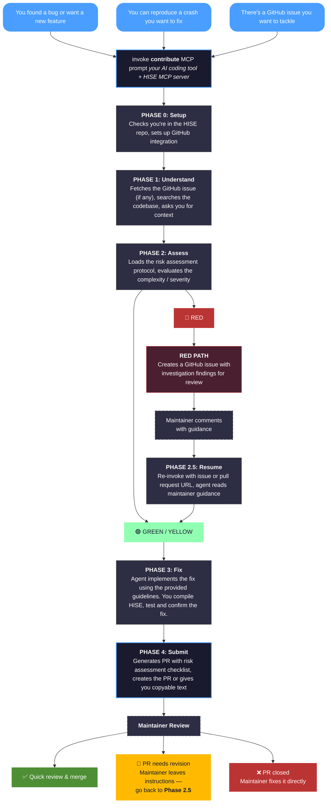

# Contributing to HISE with AI Tools

## The Problem

HISE is maintained by one person. Every bug report, feature request, and pull request goes through the same bottleneck. When community members submit fixes, the review overhead is significant — understanding the contributor's intent, verifying the change doesn't break existing projects, checking for subtle side effects across the codebase. This mental load causes delays in both PR reviews and bug fixes, even when the fix itself is straightforward.

Meanwhile, many of you are already comfortable with HISEScript, can build HISE from source, and are increasingly using AI coding tools for development. The missing piece isn't skill — it's a structured process that produces PRs that are fast and safe to review.

That's what this workflow provides. It shifts the investigation and risk assessment work to the contributor's AI tool, so that by the time a PR arrives, it comes with evidence, a risk checklist, and a clear audit trail. The goal: faster fixes for you, faster reviews for the maintainer.

## The Workflow



## What Makes This Safe

The workflow has built-in guardrails that prevent the AI from making dangerous changes:

**The Evidence Test** — Before proposing any fix, the agent must find existing code in the HISE codebase that already does what the fix does. "Show me the precedent, don't make the argument." If there's no precedent, the fix gets flagged.

**Red Flags = Automatic Escalation** — If the change touches parameter indices, scripting API signatures, serialization formats, or DSP code, the agent stops and creates a discussion issue instead of a PR. No exceptions.

**You Control the Build** — The agent never compiles HISE. It proposes changes, you build and test in Visual Studio or Xcode. If it doesn't work, you tell the agent and iterate.

**Risk Assessment on Every PR** — Each PR includes a structured checklist: what type of change, what evidence supports it, what could be affected. This makes review fast.

## What You Need

1. **HISE built from source** — You need a working Debug build to test changes and run the debugger for crash bugs

2. **An AI coding tool with the HISE MCP server** — The server is hosted remotely, so there's nothing to install. Just add the URL to your tool's config:

   **Remote server URL:** `https://docs.hise.dev/mcp`

   <details>
   <summary><b>Claude Code</b> — add to <code>.mcp.json</code> in your HISE checkout root</summary>

   ```json
   {
     "mcpServers": {
       "hise": {
         "url": "https://docs.hise.dev/mcp"
       }
     }
   }
   ```
   </details>

   <details>
   <summary><b>OpenCode</b> — add to <code>~/.config/opencode/opencode.json</code></summary>

   ```json
   {
     "mcp": {
       "hise": {
         "type": "remote",
         "url": "https://docs.hise.dev/mcp",
         "enabled": true
       }
     }
   }
   ```
   </details>

   Any MCP-compatible tool (Cursor, Windsurf, etc.) works — just point it at the URL above. For local mode with live HISE runtime tools, see the [MCP server README](https://github.com/christoph-hart/hise_mcp_server).

3. **GitHub CLI (`gh`)** — Optional but recommended. Without it, the agent gives you copyable text to paste into GitHub manually

## Common Entry Points

**Crash bugs** — You hit a crash, reproduce it in Debug, paste the stack trace. The agent traces the root cause and proposes a fix. Your debugger output is what makes the AI effective — without it, AI tools guess at runtime behavior.

**Missing API wrappers** — A C++ method exists but isn't exposed to HISEScript. The agent finds the existing wrapper pattern (`API_METHOD_WRAPPER` / `ADD_API_METHOD`) and replicates it.

**HISE IDE glitches** — A visual bug in the module tree, property editor, or floating tile layout. These live in backend-only code and can't affect exported plugins.

**New IDE tools** — Adding a keyboard shortcut, a context menu entry, or a helper panel. Backend-only, opt-in, low risk.

**Pattern consistency fixes** — A function is missing something that all its sibling functions have. The surrounding code is your specification.

**LAF property forwarding** — A draw callback doesn't forward a property that's available in scope. The agent finds the adjacent `setProperty` calls and adds the missing one.

## What's Safe to Fix?

| Safe to fix | Needs discussion first | Always escalate |
|-------------|----------------------|-----------------|
| Null pointer crashes with clear root cause | New scripting API methods | Parameter index changes |
| Missing null/bounds checks | DSP module changes | API signature changes |
| Floating tile property additions | Features with per-instance overhead | Serialization format changes |
| LAF property forwarding gaps | | Scripting engine internals |
| UI/editor fixes (backend-only) | | Backend/frontend boundary code |
| Pattern consistency fixes | | |
| Missing API wrappers | | |

## Even "Failed" Contributions Are Valuable

If the agent flags your change as RED and creates an issue instead of a PR, that's not a failure. The issue contains:

- Root cause analysis with file:line references
- Which red flags were triggered and why
- A proposed approach for the maintainer

This saves significant investigation time. A well-documented issue is a contribution.

## Manual Contributions

If you're not using the MCP workflow, you can still submit PRs the traditional way:

1. Fork the repo and create a branch from `develop`
2. Build HISE in Debug, make your changes, and test
3. Submit a PR against `develop` with a description of what you changed and why

Key rules:

- **The Evidence Test:** Can you point to existing code that already does what your fix does? If yes, proceed. If no, expect discussion.
- **Don't break existing projects.** Never reorder parameter enums, change scripting API signatures, or modify serialization formats without discussion.
- **Code style:** Tabs, Allman braces, 120-char lines, PascalCase classes, camelCase methods. See `AGENTS.md` for details.
