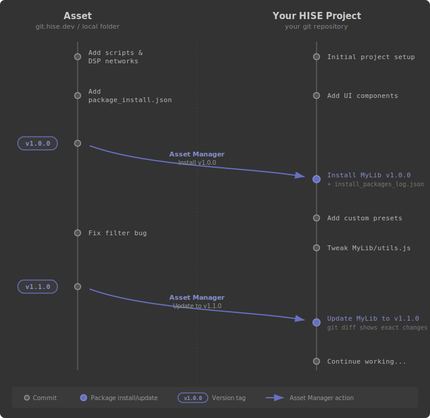

# HISE Asset Manager

## Overview

The Asset Manager is HISE's built-in package manager. It lets you install, update, and uninstall modules and extensions - collections of HISEScript files, DSP networks, sample maps, images, preprocessor definitions, and other project assets - directly from within the HISE IDE.

Packages are hosted on [git.hise.dev](https://git.hise.dev) (a Gitea instance for versioned source hosting and downloads) and listed on [store.hise.dev](https://store.hise.dev) (the product catalog with thumbnails, descriptions, and purchase management). You can also install packages from local folders to share assets across your own projects.

### What it does

The Asset Manager handles the full lifecycle of package dependencies: discovery, installation, updates, and removal. Here are the key features:

- **File installation with filtering** - only the files your package consumers need are installed, not the entire source project. Authors control what's included using subdirectory restrictions and wildcard patterns.
- **Preprocessor definitions** - packages can set C++ preprocessor definitions in your project's build settings, automatically reverted on uninstall.
- **Post-install actions** - a markdown message shown after installation and optional clipboard content (e.g. an `include()` statement to paste).
- **Semantic versioning** - versions are read from `project_info.xml`. The Asset Manager detects updates and lets you install any available version.
- **Clean uninstall with modification detection** - every installed file is hash-tracked. Modified files are preserved on uninstall rather than silently deleted.
- **Local folders for cross-project sharing** - point the Asset Manager at any local HISE project to share assets across your own projects, no store account needed. Publishing to the store later is straightforward since the format is identical.

**Example**: You maintain a UI framework with 30 scripts, 10 images, and a few DSP networks. Project A and Project B both use it. Without the Asset Manager, keeping them in sync means manually copying files between projects - and hoping you don't miss one. With the Asset Manager, you add the framework as a local folder source in each project. When you fix a bug or add a feature, you bump the version in `project_info.xml`. Both projects show the update notification and you update each with one click.

### Why not just use git submodules?

Almost every serious HISE project is under version control, so the question of what the Asset Manager brings to the table is a fair one. The short answer: git is great for managing *your own* project's history, but it's the wrong tool for managing *dependencies that merge into your project structure*. Here's why:

**Selective file installation.** Git submodules give you the entire repository - test projects, documentation, alternative implementations, everything. The Asset Manager's wildcard filters and directory restrictions let the package author curate exactly which files get installed, as described above.

**Files merge into existing directories.** Package files are copied into your project's `Scripts/`, `Images/`, `SampleMaps/` directories alongside your own files. Git submodules mount as a separate directory and can't spread files across the project structure. Git subtrees can, but they pollute the target repo's history and make merging painful.

**Preprocessor injection.** Packages can modify the target project's C++ build settings - something git has no mechanism for.

**Clean uninstall with modification detection.** The install log tracks every installed file and its content hash. Uninstalling reverses every change, and your modifications are preserved rather than silently deleted. Removing a git submodule is manual, error-prone, and has no concept of "this file was modified by the user."

**Accessible to non-developers.** Many HISE users are sound designers and musicians, not software engineers. A one-click install/update/uninstall workflow is far more accessible than managing git remotes, submodules, and merge conflicts.

### Working with git

The Asset Manager is designed to work *alongside* your existing git workflow, not replace it.



**Your project stays under your version control.** When a package is installed, its files are copied into your project's directory tree right next to your own files. From git's perspective, these are just new files appearing in a commit. You can review the diff, commit them, and push as part of your normal workflow.

**The install log is your dependency manifest.** `install_packages_log.json` records exactly which packages are installed and at which versions. Committing this file to your repo means any collaborator (or your future self) can see what packages the project depends on. It serves the same role as a lockfile in other package managers.

**Installed files are not gitignored.** Unlike `node_modules/` in JavaScript where dependencies are excluded from version control and reinstalled from a lockfile, HISE package files are meant to be committed. This ensures your project is self-contained - anyone who clones it has everything needed to build, without requiring access to the HISE store or the original package repository.

**You can modify installed files.** Since package files live in your project tree under your git control, you're free to modify them. The Asset Manager tracks the original hash of each installed file. When you uninstall or update, it detects your modifications and preserves them (flagging the package for cleanup) rather than silently overwriting your work. Your git history shows exactly what you changed and when.

**Updates produce clean diffs.** Updating a package replaces the old files with the new version. The resulting diff in your git history shows exactly what changed between package versions, giving you full visibility - something that's opaque with git submodules.

---

## Using the Asset Manager

### Opening the Asset Manager

The Asset Manager is accessible from the HISE IDE toolbar / menu.

<!-- screenshot: asset-manager-overview.png - The Asset Manager window showing the product list with several packages in various states -->

### Authentication

Authentication is only required for accessing store packages. If you are using local folders to share assets across your own projects, you can skip this section entirely - no store account or internet connection is needed.

To access your purchased packages, you need to authenticate with a personal access token from the HISE store.

1. In the Asset Manager, click the **"Get Token"** button. This opens `store.hise.dev/account/settings/` in your browser.
2. Copy your personal access token from the account settings page.
3. Paste the token into the text field in the Asset Manager's login row and click **"Login"** (or press Enter).

If the token is valid, the login row disappears and your owned packages appear in the list. Your username is shown in the status bar at the bottom of the window.

To **log out**, click your username in the status bar and confirm the prompt. This deletes the stored token and returns to the login view.

The token is stored as plain text in `storeToken.dat` in the HISE app data directory. It is used to authenticate with git.hise.dev.

### Browsing and Filtering

The top bar provides four filter tabs:

| Tab | Shows |
|-----|-------|
| **My Assets** | All packages you own (installed and uninstalled) |
| **Installed** | Only packages currently installed in this project |
| **Uninstalled** | Only owned packages not installed in this project |
| **Browse Store** | The full store catalog, including packages you don't own |

A **search bar** filters the visible packages by name. The login row and "Add local folder" row are hidden when a search term is active or when the "Installed" filter is selected.

### Package States

Each package row displays its current state through visual indicators and an action button:

<!-- screenshot: asset-manager-states.png - Several packages showing different states: an uninstalled package with download icon, an up-to-date package, one with a blue update dot, and one with an orange cleanup dot -->

| State | Visual Indicator | Action Button | Description |
|-------|-----------------|---------------|-------------|
| **Uninstalled** | Download arrow icon | "Install x.y.z" | You own the package but it's not installed in the current project |
| **Up to Date** | *(none)* | "Uninstall x.y.z" | Installed at the latest available version |
| **Update Available** | Blue dot | "Update to x.y.z" | A newer version exists on the server |
| **Pending Cleanup** | Orange dot | "Cleanup" | Uninstall detected files you had modified and preserved them instead of deleting |
| **Not Owned** | *(none)* | "View in HISE store" | Visible in the store catalog but you haven't purchased it |

### Installing, Updating, and Uninstalling

**Install / Update**: Click the action button on an uninstalled or outdated package. The Asset Manager downloads the zip archive for the selected version, extracts the files matching the package's filter rules, and copies them into the current project. If an older version is already installed, it is uninstalled first.

**Uninstall**: Click the action button on an up-to-date package. The Asset Manager undoes all changes made during installation. For each installed text file, it compares the current content hash against the hash recorded at install time:
- If the file is unchanged, it is deleted.
- If the file was modified by you, it is **preserved** and the package is flagged for **cleanup** (shown with an orange dot).
- Binary files (images, samples) are always deleted since they cannot be meaningfully diffed.

**Cleanup**: When modified files were preserved during uninstall, the package shows an orange dot and the action button reads "Cleanup". Clicking it shows a list of the preserved files and asks for confirmation. On confirmation, all listed files are force-deleted, completing the uninstall. This is a destructive operation - make sure you've committed or backed up any changes you want to keep.

**Revert to version**: Right-click a package (or click the "..." menu) to see all available version tags. Selecting a version installs that specific tag, replacing whatever is currently installed. This lets you pin to an older version or test a specific release.

<!-- screenshot: asset-manager-context-menu.png - The right-click popup menu showing Install, Uninstall, Cleanup, Show in store / Show folder, Remove local asset folder, and the Revert to version submenu with several version tags listed -->

The full right-click menu contains:

| Menu Item | When Available |
|-----------|---------------|
| Install latest version | Update available, no cleanup pending |
| Uninstall from project | Currently installed, no cleanup pending |
| Cleanup modified files | Only when modified files were preserved during uninstall |
| Show in store / Show folder | Always (opens store page for web packages, reveals folder for local packages) |
| Remove local asset folder | Local folder packages only |
| Revert to version | Submenu listing all version tags |

### Local Development Folders

Local folders are a fully standalone feature that works without a store account, authentication, or internet connection. You can add any local HISE project folder as a package source to share assets across your projects.

**Adding a local folder**: Click the "Add local folder" row at the bottom of the package list. Navigate to the source project's `package_install.json` file and select it. The Asset Manager reads the source project's `project_info.xml` and `user_info.xml` to determine the package name, version, and vendor.

**How local packages differ from store packages**:
- No store account or authentication required - works entirely offline.
- No download step - files are copied directly from the local folder on disk.
- The package row shows a folder icon instead of a product thumbnail.
- The description line shows the local folder's absolute path instead of a product description.
- There is no tag-based version history - the available version is whatever `project_info.xml` currently says.
- "Show in store" becomes "Show folder" in the right-click menu.

**Removing a local folder**: Right-click the package and select "Remove local asset folder". This removes the folder reference from the Asset Manager's tracked list. It does **not** uninstall any files that were previously installed from that folder - uninstall explicitly first if needed.

Local folder references are persisted in `localAssetFolders.js` in the HISE app data directory.

---

## Creating a Package

This section is for module developers who want to create packages that others can install through the Asset Manager.

### Project Setup

Your source project must have:

1. **`project_info.xml`** with at least `Name` and `Version` fields set. The `Name` becomes the package identifier and the `Version` (expected to follow semantic versioning, e.g. `1.0.0`) determines the available version.
2. **`user_info.xml`** with the `Company` field set. This is displayed as the vendor/author name.
3. **`package_install.json`** in the project root. This file defines which files to include, what preprocessors to set, and what post-install actions to perform.

The package name, version, and vendor are all read from the XML settings files - there is no separate metadata in `package_install.json`.

### The Creator Dialog

HISE provides a wizard dialog to help you create and edit `package_install.json`:

**Menu path**: Export > **Create HISE store payload from current project**

<!-- screenshot: asset-manager-creator.png - The Creator Dialog (page 2) with the Wildcards and File Type Filter sections unfolded, showing the include/exclude wildcard fields and the file type tag selector -->

The dialog has three pages:

**Page 1 - Introduction**: Explains the purpose of the package configuration. The **"Load settings"** checkbox (on by default) loads an existing `package_install.json` from your project root so you can edit it rather than starting from scratch.

**Page 2 - Configuration**: This is where you define what the package includes. All sections are foldable and collapsed by default:

- **InfoText**: A multiline text field for a markdown-formatted message that will be shown to users after they install the package. A live preview is displayed below the editor. Use this for important installation instructions, setup steps, or links to documentation.

- **Wildcards**: Two multiline fields (one pattern per line):
  - *Include Wildcards* (default: `*`): Patterns that files must match to be included. See the [JSON reference](#package_installjson-reference) for matching rules.
  - *Exclude Wildcards*: Patterns that remove matching files from the included set.

- **File Type Filter**: A toggle ("Use File type filter") and a tag selector. When enabled, only files from the selected subdirectories are considered. Available directories: `Scripts`, `AdditionalSourceCode`, `Samples`, `Images`, `AudioFiles`, `SampleMaps`, `MidiFiles`, `DspNetworks`.

- **Preprocessors**: A toggle ("Add preprocessors") and a tag selector populated from the project's extra preprocessor definitions (configured in HISE's project settings). Selected preprocessor values will be written into the target project's build settings on install and reverted on uninstall.

- **Clipboard**: A toggle ("Copy to clipboard") and a multiline text field. When enabled, the specified text is copied to the system clipboard after installation - useful for providing a HISEScript `include` statement or a HISE snippet that the user can paste into their project.

**Page 3 - Finish and Test**: See [Testing with Dry Run](#testing-with-dry-run) below. Clicking **"Finish"** writes the cleaned-up JSON to `<project_root>/package_install.json`.

### `package_install.json` Reference

All fields are optional. An empty JSON object `{}` with no filters would include every file in the project (subject to the automatic exclusions listed below).

If you're familiar with `.gitignore`, the mental model here is inverted: a `.gitignore` file tells git what to **ignore**, while `package_install.json` tells the Asset Manager what to **install**. The wildcard syntax is similar - glob patterns with `*` for matching, one pattern per line - but the direction is opposite. Include wildcards (`PositiveWildcard`) define what gets included; exclude wildcards (`NegativeWildcard`) then remove matches from that set.

| Field | Type | Default | Description |
|-------|------|---------|-------------|
| `FileTypes` | `string[]` | all directories | Restrict to specific project subdirectories. Valid values: `Scripts`, `AdditionalSourceCode`, `Samples`, `Images`, `AudioFiles`, `SampleMaps`, `MidiFiles`, `DspNetworks` |
| `PositiveWildcard` | `string[]` | `["*"]` | Include patterns (files must match at least one). Patterns without `*` match as substrings against the path relative to the project root |
| `NegativeWildcard` | `string[]` | `[]` | Exclude patterns. Matching files are removed from the included set |
| `Preprocessors` | `string[]` | `[]` | C++ preprocessor define names. Their values from the source project's `ExtraDefinitions` settings are applied to the target project on install |
| `InfoText` | `string` | `""` | Markdown text shown to the user after installation |
| `ClipboardContent` | `string` | `""` | Text copied to the system clipboard after installation |

**Minimal example** - include only Scripts and Images:

```json
{
  "FileTypes": ["Scripts", "Images"],
  "PositiveWildcard": ["*"]
}
```

**Targeted example** - include only files under a specific path, excluding test files:

```json
{
  "PositiveWildcard": ["MyLibrary/"],
  "NegativeWildcard": ["*_test.js", "*_debug*"]
}
```

**Full example** - restrict to Scripts, filter by path, set preprocessors, show post-install instructions:

```json
{
  "FileTypes": ["Scripts", "DspNetworks"],
  "PositiveWildcard": ["MyDSPLib/"],
  "NegativeWildcard": ["*.bak", "*_old*"],
  "Preprocessors": ["USE_MY_DSP_LIB", "MY_DSP_LIB_NUM_CHANNELS"],
  "InfoText": "## Setup\n\nAdd `include(\"MyDSPLib/MyDSPLib.js\")` to your main script's `onInit` callback."
}
```

### Automatic File Exclusions

Regardless of your wildcard settings, the following are always excluded from the install payload:

**Directories**: Only files are installed. Empty directories are not created.

**The `Binaries/` subdirectory**: Build output is never included.

**Reserved filenames**: These files are always skipped:
- `.gitignore`
- `expansion_info.xml`
- `project_info.xml`
- `user_info.xml`
- `RSA.xml`
- `package_install.json`
- `install_packages_log.json`
- `Readme.md`

**How files are filtered**: Directory restriction (`FileTypes`) -> reserved filename exclusion -> include wildcards (`PositiveWildcard`, file must match at least one) -> exclude wildcards (`NegativeWildcard`, matching files are removed). A file that passes all four stages is included in the package.

### Testing with Dry Run

**This is the most important step in creating a package.** The dry run simulates a full installation without writing any files, printing every action to the HISE console. Use it to verify that your wildcard filters produce exactly the file list you intend before publishing.

The dry run is available on **Page 3** of the Creator Dialog:

1. Configure your `package_install.json` on Page 2.
2. Advance to Page 3.
3. Click **"Simulate test run"**.
4. Check the HISE console output. Every file copy, preprocessor change, and post-install action is logged.

**Optional**: Use the **"Test Archive"** file selector to point to a `.zip` of a different HISE project. The simulator will use that zip's contents as the source instead of the current project's files, letting you test how a downloaded package would install into another project.

**Recommended workflow**:
1. Start with a broad configuration (few filters).
2. Run the simulation.
3. Review the console output - look for files you don't want included.
4. Tighten your wildcards and file type filters.
5. Run the simulation again.
6. Repeat until the output lists exactly the files your package should install.

Remember: **by default, ALL project files are included**. You almost always want to add filters to reduce the payload to only the files your package consumers actually need.

Example console output from a dry run:

```
  Installing  synth_building_blocks 
  ==================================

Master Chain: TEST: > Set HISE_NUM_CHANNELS: 4

Master Chain: TEST: > Extract D:/Development/Projekte/sbb/DspNetworks/ThirdParty/src/sbb/sbb.h
Master Chain: TEST: > Extract D:/Development/Projekte/sbb/DspNetworks/ThirdParty/src/sbb/sbb_fm.h
Master Chain: TEST: > Extract D:/Development/Projekte/sbb/DspNetworks/ThirdParty/src/sbb/sbb_group_compiler.h
Master Chain: TEST: > Extract D:/Development/Projekte/sbb/DspNetworks/ThirdParty/src/sbb/sbb_group_tools.h
Master Chain: TEST: > Extract D:/Development/Projekte/sbb/DspNetworks/ThirdParty/src/sbb/sbb_mods.h
Master Chain: TEST: > Extract D:/Development/Projekte/sbb/DspNetworks/ThirdParty/src/sbb/sbb_multiframe.h
Master Chain: TEST: > Extract D:/Development/Projekte/sbb/DspNetworks/ThirdParty/src/sbb/sbb_osc_wrapper.h
Master Chain: TEST: > Extract D:/Development/Projekte/sbb/DspNetworks/ThirdParty/src/sbb/sbb_render_group.h
Master Chain: TEST: > Extract D:/Development/Projekte/sbb/DspNetworks/ThirdParty/src/sbb/sbb_template_helpers.h
Master Chain: TEST: > Extract D:/Development/Projekte/sbb/DspNetworks/ThirdParty/src/sbb/sbb_unisono.h
Master Chain: TEST: > Extract D:/Development/Projekte/sbb/Scripts/NodeDisplay.js
Master Chain: TEST: 

  Install instructions for synth_building_blocks 
  ===============================================
This is the install procedure.

Compile networks & use the sbb templates in your C++ nodes
```

### Versioning

Package versions are always read from the source project's `project_info.xml` `Version` field. The Asset Manager compares the installed version (recorded at install time) against the currently available version and flags updates when the available version is newer, using semantic version comparison.

**Store packages**: Each git tag on git.hise.dev represents a downloadable version. Tags are expected to follow semantic versioning (e.g. `1.0.0`, `1.1.0`, `2.0.0`). The Asset Manager fetches all tags, sorts them semantically, and presents the latest as the available version. Users can install any tagged version through the "Revert to version" submenu. The tag name and the `Version` field in `project_info.xml` inside that tagged commit should match.

**Local folder packages**: The available version is read directly from the source folder's `project_info.xml`. There is no version history - the only available version is whatever the source project currently declares. When you bump the `Version` field in your source project, the Asset Manager detects this as an update and offers the same update flow as store packages.

### Sharing and Publishing

Once your `package_install.json` is configured and verified with a dry run, you can share your package in two ways:

**Local folders** (no store account needed): Other projects can install your package directly from its folder on disk. See [Local Development Folders](#local-development-folders) for how consumers add and manage local folder sources. To trigger an update for consumers, bump the `Version` in your `project_info.xml`.

**HISE Store**: To distribute your package publicly:

1. Host your project as a repository on [git.hise.dev](https://git.hise.dev).
2. Ensure the repository contains `package_install.json`, `project_info.xml`, and `user_info.xml` in its root.
3. Create git tags for each release version (e.g. `1.0.0`).
4. List the product on [store.hise.dev](https://store.hise.dev) with the repository URL pointing to your git.hise.dev repository.

The transition from local folders to the store is seamless - the package format is identical. Users who purchase or own the product will see it in their "My Assets" tab.

---

## Install Log Reference

This section documents the internal data formats used by the Asset Manager. It is intended for contributors and for debugging installation issues.

### `install_packages_log.json`

**Location**: `<project_root>/install_packages_log.json`

This file is a JSON array where each element represents one installed package. It is written on install, updated on uninstall (either removed or updated to record pending cleanup), and should be committed to your project's git repository as a dependency manifest.

**Per-package entry**:

| Field | Type | Description |
|-------|------|-------------|
| `Name` | string | Package name (from source project's `project_info.xml`) |
| `Company` | string | Vendor name (from source project's `user_info.xml`) |
| `Version` | string | Installed version string |
| `Date` | string | ISO 8601 timestamp of installation |
| `Mode` | string | One of: `StoreDownload`, `LocalFolder`, `UninstallOnly`, `Undefined` |
| `Steps` | array | Array of records describing each change made during installation (used to reverse changes on uninstall) |

### Step Types

Each entry in the `Steps` array has a `Type` field and type-specific data:

**`File`** - A file that was copied into the target project:

| Field | Type | Description |
|-------|------|-------------|
| `Type` | `"File"` | Step type identifier |
| `Target` | string | Relative path from project root (forward slashes) |
| `Hash` | int64 | Content hash at install time (text files only, used for modification detection) |
| `Modified` | string | ISO 8601 timestamp of the file's last modification time at install |

**`Preprocessor`** - C++ preprocessor definitions that were modified:

| Field | Type | Description |
|-------|------|-------------|
| `Type` | `"Preprocessor"` | Step type identifier |
| `Data` | object | Keys are preprocessor names; values are `[oldValue, newValue]` arrays |

**`ProjectSetting`** - Project settings that were modified:

| Field | Type | Description |
|-------|------|-------------|
| `Type` | `"ProjectSetting"` | Step type identifier |
| `oldValues` | object | Map of setting identifiers to their pre-install values |
| `newValues` | object | Map of setting identifiers to their post-install values |

**`Info`** and **`Clipboard`** - Marker-only steps with no additional data (just `{ "Type": "Info" }` or `{ "Type": "Clipboard" }`).

### Pending Cleanup

When an uninstall detects modified files (content hash mismatch on text files), the package's log entry is updated instead of removed. The relevant JSON field is `NeedsCleanup`:

| Field | Change |
|-------|--------|
| `NeedsCleanup` | Set to `true` |
| `SkippedFiles` | Array of absolute file paths that were preserved |
| `Steps` | **Removed** (undo was already performed for non-skipped files) |

When the user runs "Cleanup", the skipped files are force-deleted and the entire entry is removed from the log.

### Persistent Files

| File | Location | Purpose |
|------|----------|---------|
| `install_packages_log.json` | Project root | Install log / dependency manifest |
| `storeToken.dat` | HISE app data directory | Bearer authentication token (plain text) |
| `localAssetFolders.js` | HISE app data directory | JSON array of absolute paths to local development folder sources |
